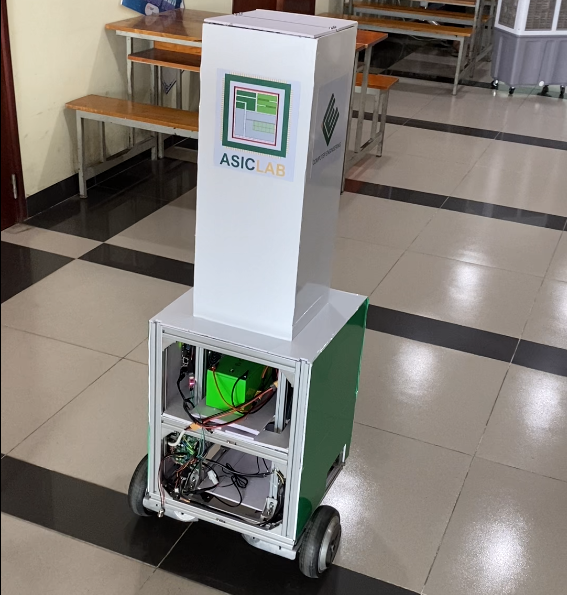
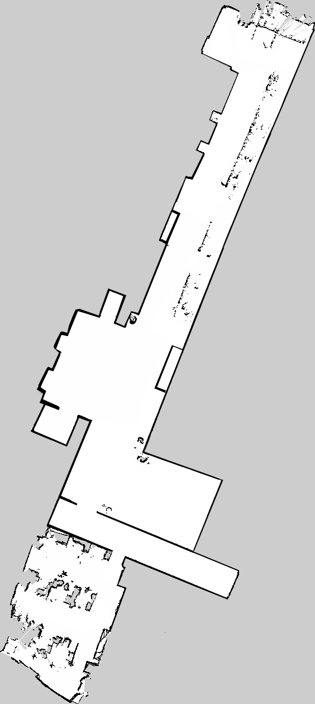
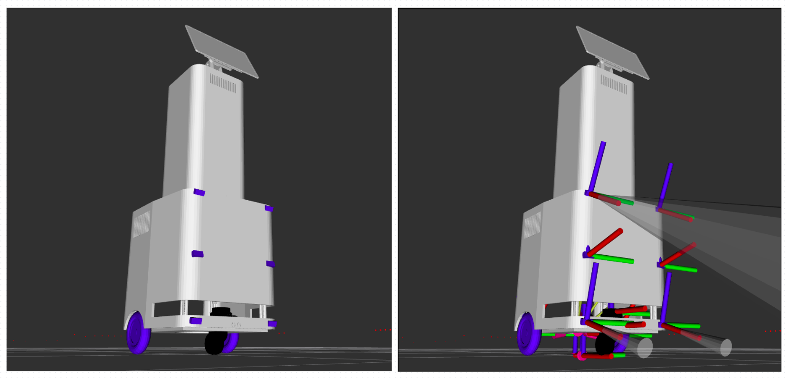

# 🤖 Autonomous Service Robot — Hardware Implementation

<div align="center">


**A fully autonomous indoor service robot — deployed on physical hardware at the Faculty of Computer Engineering, UIT.**

[📦 Simulation Repo](https://github.com/NguyenAn080105/mobile-robot-ros2) · [🔧 Hardware Repo](https://github.com/NguyenAn080105/mobile-robot-ros2-hardware)

</div>

---

## 🎬 Demo

> Robot navigating autonomously across multiple checkpoints in a real indoor corridor environment.

<!-- TODO: Replace with your actual YouTube Unlisted link and thumbnail -->
[](https://youtube.com/shorts/xZ_uI3XExD0?feature=share)

---

## 📸 Results

### SLAM — Real-world Map Building
> Occupancy grid map built using `slam_toolbox` on the actual CE faculty corridor.



---

### Localization & TF Tree in RViz
> AMCL particle cloud converging on the pre-built map. Full TF chain: `map → odom → base_footprint → sensors`.


<!-- ### Autonomous Navigation
> Nav2 planning a collision-free path to a target checkpoint. Local costmap reacting to real obstacles.

<!-- TODO: Add RViz navigation screenshot -->
<!--  -->

---

## 📌 What This Robot Does

- 🗺️ **Builds a map** of its environment autonomously using LiDAR SLAM
- 📍 **Localizes itself** on the map in real time using AMCL + EKF sensor fusion
- 🚗 **Navigates autonomously** to named checkpoints (Library, Meeting Room, etc.) while avoiding obstacles
- 🛑 **Stops safely** when obstacles appear within 20 cm, resumes when the path is clear
- 🔄 **Recovers** from stuck situations using spin, backup, and wait behaviors
- 📱 **Integrates with an App UI** — a touchscreen on the robot lets users tap a destination and the robot goes there

---

## 🌐 Project Ecosystem

This robot is the physical core of a larger multi-team service robot system:

```
╔══════════════════════════════════════════════════════════════════════╗
║                    Grand Project — System Overview                   ║
╠══════════════════════╦═══════════════════════╦═══════════════════════╣
║   App (UX/UI) Team   ║       ROS Teamm       ║        AI Team        ║
║                      ║                       ║                       ║
║  Touchscreen UI on   ║  SLAM, Localization,  ║  On-device Chatbot    ║
║  robot display:      ║  Navigation, Hardware ║  integrated into      ║
║  • Direction View    ║  integration on       ║  the App UI           ║
║  • Running View      ║  Jetson AGX Xavier    ║                       ║
║  • Chatbot UI        ║                       ║                       ║
║                      ║  Exposes REST API  →  ║                       ║
║  Sends go/stop/      ║  receives commands,   ║                       ║
║  continue/reset via  ║  publishes robot      ║                       ║
║  REST API calls      ║  state back to App    ║                       ║
╚══════════════════════╩═══════════════════════╩═══════════════════════╝
```

The App team's touchscreen UI calls our navigation API. When a user taps a destination, our `navigator.py` state machine receives the command and dispatches it to Nav2. The AI Chatbot, embedded in the same UI, allows users to ask about the robot's current status.

### 🤖 ROS Team — Full Scope

| Layer | Responsibility |
|---|---|
| **Simulation** | Gazebo world, URDF/Xacro modeling, sensor plugins, costmap validation |
| **SLAM** | `slam_toolbox` for map building; pre-built maps stored per floor |
| **Localization** | AMCL (Monte Carlo particle filter) + EKF (wheel odom + IMU fusion) |
| **Navigation** | Nav2: NavFn A* global planner, DWB local planner, BT navigator, recoveries |
| **Hardware Integration** | Sensor drivers, motor bridge, safety layer, sequenced bringup |

<!-- ### 👥 ROS Team

- **[@Teammate1]** — SLAM development, map building, slam_toolbox tuning
- **[@Teammate2]** — Nav2 configuration, costmap design, behavior tree -->

➡️ **Simulation Repository:** [mobile-robot-ros2](https://github.com/NguyenAn080105/mobile-robot-ros2)

> 📁 Full source code is maintained in a private team repository. **Code samples available upon request.**

---

## 🔧 My Personal Contributions

| Area | What I Built |
|---|---|
| **Hardware Architecture** | Power topology (36V drive / 12V compute), wiring, carrier board integration (Auvidea X221-AI) |
| **Motor Control Bridge** | Custom UART node: parses STM32F103RCT6 wheel speed packets, computes differential drive odometry, encodes `cmd_vel` → FOC commands |
| **Sensor Integration** | RPLiDAR S2E over UDP/LAN, BNO055 IMU over I2C, 7-channel ultrasonic array via ESP32 UART bridge |
| **Ultrasonic Safety Layer** | Median-filtered hard-stop gate with hysteresis; fuses sensor data into a `LaserScan` for Nav2 costmap |
| **Real-World Tuning** | EKF covariance, AMCL particle filter, DWB velocity limits, LiDAR angular exclusion zones for physical obstructions |
| **Sequenced Bringup** | 13-node launch system with staged `TimerAction` delays to prevent hardware race conditions |
| **Checkpoint Navigator** | 7-state FSM accepting `go / stop / continue / reset` commands; pre-rotates to align heading before sending Nav2 goal |

---

## 🔩 Hardware

<!-- TODO: Add photo of the physical robot -->
<!--  -->

| Component | Model | Interface |
|---|---|---|
| **Main Computer** | NVIDIA Jetson AGX Xavier 16GB | — |
| **Carrier Board** | Auvidea X221-AI | — |
| **LiDAR** | RPLiDAR S2E | UDP / LAN |
| **IMU** | Bosch BNO055 | I2C (J23, bus 8) |
| **Motor Controller** | STM32F103RCT6 (Hoverboard FOC) | UART (J33) |
| **Ultrasonic Bridge** | ESP32 + 7× HC-SR04 | UART |
| **Drive System** | Hoverboard wheels (2×) | PWM via STM32 |
| **Display** | Touchscreen | App UI |
| **Emergency Stop** | Physical button | Hardware (cuts 36V) |

### Power Architecture

```
Battery (36V) ──► Hoverboard Drive ──► Left / Right Motors
                       │
                       └──► DC-DC (12V) ──► Jetson + LiDAR
```

---

## ⚙️ System Architecture

### Full Data Flow

```
[RPLiDAR S2E] ──/scan──► laser_filters ──/scan_filtered──► AMCL ──► TF map→odom
                                                        └─────────► Costmaps

[BNO055 IMU]  ──/imu/data──┐
                           ├──► EKF (50 Hz) ──► /odometry/filtered ──► Nav2
[STM32 UART]  ──/odom ─────┘

                                        Nav2 (NavFn A* + DWB)
                                               │ /cmd_vel_nav
                                        ultrasonic_fusion_node
                                        (hard-stop safety gate)
                                               │ /cmd_vel
                                        wheel_odom_node
                                        (UART TX → STM32 FOC)
```

### Software Stack

| Layer | Tool |
|---|---|
| **OS** | Ubuntu 20.04 (ARM64, JetPack) |
| **Middleware** | ROS 2 Foxy + FastRTPS |
| **Map Building** | `slam_toolbox` (offline; maps saved per floor) |
| **Localization** | `nav2_amcl` + `robot_localization` EKF |
| **Global Planner** | NavFn (A* mode) |
| **Local Planner** | DWB (Dynamic Window Approach) |
| **Recovery** | Spin, Backup, Wait |
| **LiDAR Driver** | `sllidar_ros2` (UDP) |
| **IMU Driver** | `bno055` ROS 2 |
| **Safety Layer** | Custom `ultrasonic_fusion_node.py` |
| **Motor Bridge** | Custom `wheel_odom_node.py` |

### TF Tree

```
map
 └── odom
      └── base_footprint
           ├── base_link
           │    ├── chassis
           │    │    ├── laser_frame       ← RPLiDAR S2E
           │    │    ├── imu_link          ← BNO055
           │    │    └── us_*_link (×6)   ← Ultrasonic sensors
           │    ├── left_wheel
           │    └── right_wheel
           └── caster_wheel
```

---

## 🗺️ Checkpoint Navigation

The `navigator.py` state machine accepts 4 commands and manages the full navigation lifecycle:

```
              go <id>
   ┌──────────────────────────────────────────────┐
   ▼                                              │
┌──────┐  ┌────────────────┐  ┌──────────────┐    │
│ IDLE │─►│ COMPUTING_PATH │─►│ PRE_ROTATING │    │
└──────┘  └────────────────┘  └──────┬───────┘    │
                                     │            │
                               ┌─────▼──────┐     │
                    stop       │ NAVIGATING │     │
               ┌───────────────│            │     │
               ▼               └─────┬──────┘     │
          ┌─────────┐                │ succeeded  │
          │ STOPPED │                └───────────►┘
          └────┬────┘
    continue   │   reset
               ▼
       ┌──────────────┐  go <id>
       │WAITING_RESET │──────────► COMPUTING_PATH
       │   30s timer  │
       └──────┬───────┘
              │ timeout
       ┌──────▼───────┐
       │RETURNING_HOME│ (3 retries)
       └──────────────┘
```

### Defined Checkpoints (Floor E6)

| ID | Location | Coordinates (map frame) |
|---|---|---|
| `0` | LAB Room (**Home**) | (−0.020, −0.002) |
| `1` | Elevator | (−4.143, 6.675) |
| `2` | Meeting Room (E6.3) | (3.197, 17.291) |
| `3` | Dean's Room | (5.027, 23.810) |

---

## 🚀 Quick Start

### Environment Setup

```bash
# Both Jetson and laptop must share the same config
export ROS_DOMAIN_ID=42
export RMW_IMPLEMENTATION=rmw_fastrtps_cpp
source ~/ros2_ws/install/setup.bashs
```

### Build

```bash
cd ~/ros2_ws/src
git clone https://github.com/NguyenAn080105/mobile-robot-ros2-hardware.git mobile_robot
cd ~/ros2_ws
rosdep install --from-paths src --ignore-src -r -y
colcon build --packages-select mobile_robot --symlink-install
```

### Launch

```bash
# Full hardware bringup (default: floor e6)
ros2 launch mobile_robot nav_v2_launch.py

# Specific floor
ros2 launch mobile_robot nav_v2_launch.py floor:=e1
```

### Control

```bash
# Interactive CLI
ros2 run mobile_robot checkpoint_cmd.py
```

```
[IDLE | go <id>]> go 1          # Navigate to Library
[NAVIGATING | stop]> stop       # Halt immediately
[STOPPED | continue | reset]> continue   # Resume
```

---

## 🔄 Simulation → Hardware

| Aspect | Simulation | Hardware |
|---|---|---|
| LiDAR | Gazebo plugin | `sllidar_ros2` UDP |
| IMU | Gazebo plugin | `bno055` I2C |
| Odometry | Gazebo ground truth | STM32 UART + kinematics |
| Motor control | Gazebo joint controller | STM32 FOC via UART |
| Ultrasonic | Gazebo sensors | ESP32 UART bridge |
| cmd_vel | Direct to Gazebo | Gated through safety node |
| TF odom→base | Gazebo truth | EKF fusion (50 Hz) |

---

## 🐛 Troubleshooting

**Serial device not found**
```bash
ls -la /dev/ttyWheel /dev/ttyUltrasonic
sudo usermod -aG dialout $USER   # then relogin
```

**AMCL not localizing**
```bash
# Manually re-publish initial pose in RViz
# or republish via CLI — see launch file for default pose values
ros2 topic hz /scan_filtered     # verify scan is arriving
```

**RViz on laptop not seeing topics**
```bash
# Verify on both machines
echo $ROS_DOMAIN_ID              # must match (42)
echo $RMW_IMPLEMENTATION         # must match
ros2 node list                   # should show Jetson nodes
```

---

## 📄 References

- [ROS 2 Foxy](https://docs.ros.org/en/foxy/)
- [Nav2](https://navigation.ros.org/)
- [robot_localization EKF](http://docs.ros.org/en/melodic/api/robot_localization/html/index.html)
- [slam_toolbox](https://github.com/SteveMacenski/slam_toolbox)
- [sllidar_ros2](https://github.com/Slamtec/sllidar_ros2)
- [Hoverboard FOC Firmware](https://github.com/EFeru/hoverboard-firmware-hack-FOC)

---

## 📜 License

MIT License — see [LICENSE](LICENSE) for details.

---

<div align="center">

**NguyenAn080105** · [GitHub](https://github.com/NguyenAn080105) · Computer Engineering · UIT

*ROS Team — Mobile Robot LiDAR Project*

</div>