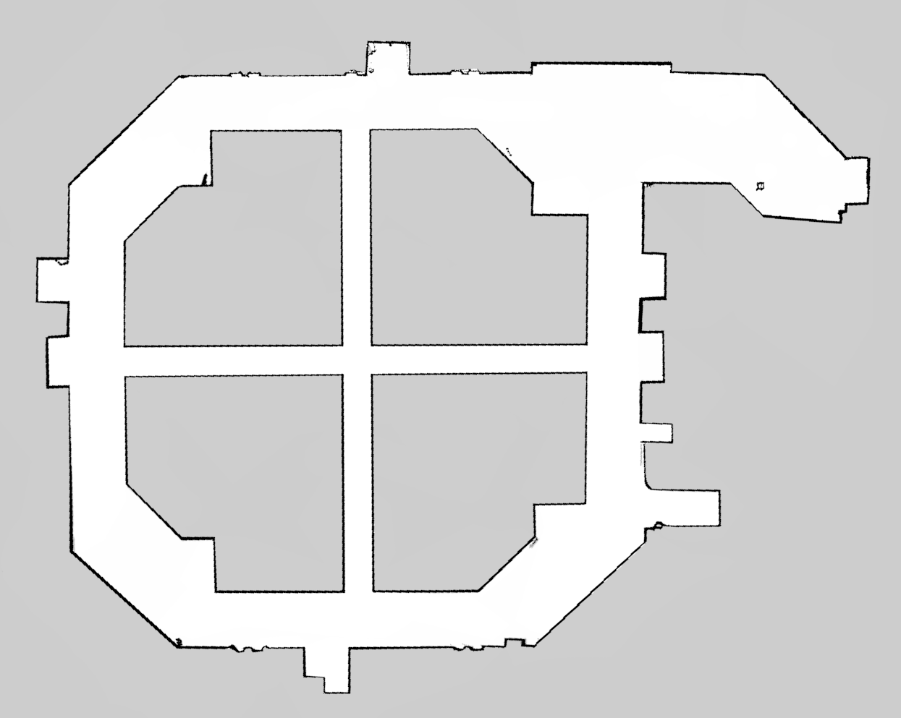

<div align="center">

# 🤖 Autonomous Service Robot — Hardware Implementation

[](https://docs.ros.org/en/foxy/)
[](https://developer.nvidia.com/embedded/jetson-agx-xavier)
[](https://www.python.org/)
[](https://ubuntu.com/)
[](https://navigation.ros.org/)
[](LICENSE)

**A fully autonomous indoor service robot — deployed on physical hardware  
at the Faculty of Computer Engineering, UIT-VNUHCM.**

[📦 Simulation Repo](https://github.com/NguyenAn080105/mobile-robot-ros2) · [🔧 Hardware Repo](https://github.com/NguyenAn080105/mobile-robot-ros2-hardware)

</div>

---

## 🎬 Demo

> Robot navigating autonomously across multiple checkpoints in a real indoor corridor.

[](https://youtube.com/shorts/xZ_uI3XExD0?feature=share)

---

## 📸 Results

### SLAM — Real-world Map Building

<table>
<tr>
<td align="center" width="50%">

**Floor E6 — CE Faculty Corridor**

<br/><sub>Occupancy grid built with <code>slam_toolbox</code> on the E6 corridor</sub>

</td>
<td align="center" width="50%">

**Building A1 — UIT Main Building, Floor 1**

<br/><sub>Full-floor map — largest environment deployed to date (16 checkpoints)</sub>

</td>
</tr>
</table>

### Localization in RViz

<div align="center">

<br/><sub>AMCL particle cloud converging on the pre-built map · TF chain: <code>map → odom → base_footprint → sensors</code></sub>
</div>

---

## 📌 What This Robot Does

| Capability | Description |
|---|---|
| 🗺️ **Mapping** | Builds a 2D occupancy grid autonomously using LiDAR SLAM |
| 📍 **Auto-localization** | Calls global localization at startup, spins to gather observations, and confirms pose — no manual initial pose needed |
| 🚗 **Autonomous Navigation** | Plans and executes paths to named checkpoints while avoiding dynamic obstacles |
| ⏱️ **Dwell & Auto-return** | Waits 15 s at destination; returns home automatically if no new command is received |
| 🛑 **Obstacle Safety** | Stops when Nav2 costmap detects obstacles; resumes when path is clear |
| 🔄 **Recovery** | Spin, backup, and wait behaviors when stuck |
| 📱 **App Integration** | Touchscreen UI lets users tap a destination; robot navigates there |
| 🏢 **Multi-floor** | E6, E1, and A1 maps + checkpoint sets — switchable via a single launch argument |

---

## 🌐 Project Ecosystem

This robot is the physical core of a multi-team service robot system:

```
╔══════════════════════╦═══════════════════════╦═══════════════════════╗
║   App (UX/UI) Team   ║       ROS Team        ║        AI Team        ║
╠══════════════════════╬═══════════════════════╬═══════════════════════╣
║  Touchscreen UI:     ║  SLAM · Localization  ║  On-device Chatbot    ║
║  • Direction View    ║  Navigation · HW      ║  embedded in App UI   ║
║  • Running View      ║  integration on       ║                       ║
║  • Chatbot View      ║  Jetson AGX Xavier    ║                       ║
║                      ║                       ║                       ║
║  go/stop/continue/   ║  Exposes REST API  →  ║                       ║
║  reset via REST API  ║  publishes robot      ║                       ║
║                      ║  state back to App    ║                       ║
╚══════════════════════╩═══════════════════════╩═══════════════════════╝
```

<!-- NOTE: verify REST API contract with App team -->

**ROS Team scope:**

| Layer | Responsibility |
|---|---|
| Simulation | Gazebo world, URDF/Xacro modeling, sensor plugins, costmap validation |
| SLAM | `slam_toolbox` map building; pre-built maps stored per floor |
| Localization | AMCL + EKF (wheel odom + IMU) + autonomous startup localizer |
| Navigation | Nav2: NavFn A*, DWB local planner, BT navigator, recovery behaviors |
| Hardware Integration | Sensor drivers, motor bridge, costmap safety layer, sequenced bringup |

---

## 🔧 My Personal Contributions

| Area | What I Built |
|---|---|
| **Hardware Architecture** | Power topology (36V drive / 12V compute), wiring, carrier board integration (Auvidea X221-AI) |
| **Motor Control Bridge** | Custom UART node: parses STM32 wheel speed packets, computes differential drive odometry, encodes `cmd_vel` → FOC commands; dedicated serial reader thread + queue to prevent ROS executor blocking |
| **Sensor Integration** | RPLiDAR S2E over UDP/LAN · BNO055 IMU over I2C · 6-channel HY-SRF05 array via UART bridge |
| **Ultrasonic Costmap Layer** | Beam-cone expansion (7 rays, ±15°): converts 6× `Range` readings into a 360° `LaserScan` for Nav2 `local_costmap`; median + consistency filter eliminates transducer ring-down noise |
| **Global Localizer** | Autonomous startup: calls `/reinitialize_global_localization`, spins 360° up to 3×, checks AMCL covariance convergence, confirms via `/initialpose` — eliminates the hardcoded initial-pose workaround |
| **Real-World Tuning** | EKF covariance (30 Hz), AMCL particle filter, DWB velocity limits, LiDAR angular exclusion zones, `CMD_SCALE_STEER` calibration |
| **Sequenced Bringup** | 13-node launch with staged `TimerAction` delays; v2 adds `global_localizer` and optional ultrasonic pipeline |
| **Checkpoint Navigator** | 7-state FSM; unified `/robot/command` topic (`go:<id>` / `stop` / `continue` / `reset`); 15 s `AT_CHECKPOINT` dwell with auto-return-home; home-return retry (3× with 5 s delay) |
| **Multi-Floor Support** | Floor-indexed maps and checkpoint files (E6, E1, A1); single `floor:=<id>` argument switches entire navigation context |
| **Endurance Testing** | `endurance_test.py` — loop navigation with per-leg CSV telemetry for battery life characterization |

---

## 🔩 Hardware

<div align="center">

<!--  -->

| Component | Model | Interface |
|:---|:---|:---|
| **Main Computer** | NVIDIA Jetson AGX Xavier 16 GB | — |
| **Carrier Board** | Auvidea X221-AI | — |
| **LiDAR** | RPLiDAR S2E | UDP/LAN `192.168.11.2:8089` |
| **IMU** | Bosch BNO055 | I²C — J23, bus 8 |
| **Motor Controller** | STM32F103RCT6 (Hoverboard FOC) | UART — `/dev/ttyWheel` |
| **Ultrasonic Bridge** | UART bridge + 6× HY-SRF05 | UART — `/dev/ttyUltrasonic` |
| **Drive System** | Hoverboard wheels (2×) | PWM via STM32 |
| **Display** | Touchscreen | App UI |
| **Emergency Stop** | Physical button | Hardware — cuts 36 V rail |

</div>

**Power Architecture:**
```
Battery (36 V) ──► Hoverboard Drive ──► Left / Right Motors
                        │
                        └──► DC-DC (12 V) ──► Jetson AGX Xavier
                                         └──► RPLiDAR S2E
```

---

## ⚙️ System Architecture

### Data Flow

```
Sensors                    Processing                          Outputs
───────────────────────────────────────────────────────────────────────

[RPLiDAR S2E]  ──/scan──►  scan_to_scan_filter_chain
                                    │ /scan_filtered
                           ┌────────┴────────┐
                           ▼                 ▼
                          AMCL           Costmaps
                           │ TF map→odom
                           
[BNO055 IMU]   ──/imu/data──┐
                            ├──► EKF (30 Hz) ──► /odometry/filtered ──► Nav2
[STM32 UART]   ──/odom ─────┘

[UART bridge]  ──serial──►  jetson_sensor_bridge ──► /ultrasonic/<ch> (×6)
                                                             │
                                                  ultrasonic_fusion_node
                                                             │ /ultrasonic_scan
                                                             ▼
                                                  Nav2 local_costmap

                                           Nav2 (NavFn A* + DWB)
                                                    │ /cmd_vel
              global_localizer (boot) ──────────────┤
              checkpoint_navigator ─────────────────┘
                                                    │
                                           wheel_odom_node ──► STM32 FOC (UART TX)

App / CLI ──► /robot/command ──► checkpoint_navigator ──► /robot/state
                                                      ──► /robot/status_message
                                                      ──► /robot/current_checkpoint
```

> ⚠️ The ultrasonic pipeline (`jetson_sensor_bridge` + `ultrasonic_fusion_node`) is present in
> `nav_v2.launch.py` but currently **commented out**. Costmap obstacle avoidance relies on LiDAR only.

### Software Stack

| Layer | Tool |
|:---|:---|
| OS | Ubuntu 20.04 LTS (ARM64, JetPack) |
| Middleware | ROS 2 Foxy + FastRTPS |
| Map Building | `slam_toolbox` — offline mode, maps saved per floor |
| Localization | `nav2_amcl` + `robot_localization` EKF |
| Startup Localization | Custom `global_localizer.py` — spin + covariance convergence |
| Global Planner | NavFn (A* mode) |
| Local Planner | DWB — Dynamic Window Approach |
| Recovery Behaviors | Spin · Backup · Wait |
| LiDAR Driver | `sllidar_ros2` (UDP) |
| IMU Driver | `bno055` ROS 2 |
| Ultrasonic Layer | Custom `ultrasonic_fusion_node.py` |
| Motor Bridge | Custom `wheel_odom_node.py` |
| Checkpoint Navigator | Custom `navigator.py` — 7-state FSM |
| Endurance Testing | Custom `endurance_test.py` — loop + CSV log |

### TF Tree

```
map
 └── odom                              ← AMCL  (map → odom)
      └── base_footprint               ← EKF   (odom → base_footprint)
           └── base_link
                ├── chassis
                │    ├── laser_frame            ← RPLiDAR S2E
                │    ├── imu_link               ← BNO055
                │    ├── us_top_left_link       ┐
                │    ├── us_top_right_link      │
                │    ├── us_mid_top_left_link   ├ 6× HY-SRF05
                │    ├── us_mid_top_right_link  │
                │    ├── us_mid_bot_left_link   │
                │    ├── us_mid_bot_right_link  ┘
                │    └── caster_wheel
                ├── left_wheel
                └── right_wheel
```

---

## 🗺️ Checkpoint Navigation

Commands are delivered via `/robot/command` (`std_msgs/String`):
**`go:<id>`** · **`stop`** · **`continue`** · **`reset`**

### State Machine

```
                     go:<id>
        ┌──────────────────────────────────────────────────┐
        ▼                                                  │
    ┌──────┐    ┌────────────────┐    ┌──────────────┐     │
    │ IDLE │───►│ COMPUTING_PATH │───►│ PRE_ROTATING │     │
    └──────┘    └────────────────┘    └──────┬───────┘     │
                                             │             │
                                      ┌──────▼──────┐      │
                                      │  NAVIGATING │      │
                                      └──────┬──────┘      │
                         stop               │ succeeded    │
                   ┌─────────────────────   │              │
                   ▼                    │   ▼              │
              ┌─────────┐          ┌──────────────┐        │
              │ STOPPED │          │AT_CHECKPOINT │        │
              └────┬────┘          │  (15 s dwell)│        │
       continue    │   reset       └──────┬───────┘        │
                   │                      │ go:<id>        │
                   │               ┌──────┴────────────────┘
                   │               │ timeout (no command)
                   │        ┌──────▼────────┐
                   │        │ WAITING_RESET │ (30 s timer)
                   │        └──────┬────────┘
                   │        go:<id>│  timeout
                   │               ▼
                   │       ┌───────────────┐
                   └──────►│RETURNING_HOME │ (retry ×3, 5 s each)
                           └───────┬───────┘
                                   │ arrived
                                 IDLE
```

### Defined Checkpoints

<details open>
<summary><strong>Floor E6 — CE Faculty Corridor</strong></summary>

| ID | Location | x (m) | y (m) |
|:---:|:---|:---:|:---:|
| `0` | LAB Room *(Home)* | −0.020 | −0.002 |
| `1` | Elevator | −4.143 | 6.675 |
| `2` | Meeting Room E6.3 | 3.197 | 17.291 |
| `3` | Dean's Room | 5.027 | 23.810 |

</details>

<details>
<summary><strong>Floor E1</strong></summary>

| ID | Location | x (m) | y (m) |
|:---:|:---|:---:|:---:|
| `0` | Meeting Room E1.1 *(Home)* | −15.225 | −2.860 |
| `1` | Elevator | −8.436 | 2.180 |
| `3` | CELUiT's Office | 6.510 | −0.004 |

</details>

<details>
<summary><strong>Building A1 — UIT Main Building, Floor 1</strong> &nbsp;<em>(16 checkpoints)</em></summary>

| ID | Location |
|:---:|:---|
| `0` | Sảnh chính Tòa A *(Home)* |
| `100` | Thư viện |
| `101` | A101 — Phòng Công tác sinh viên |
| `102` | A102 — Phòng Đào tạo Đại học chính quy |
| `110` | A110 — Phòng Thí nghiệm Hệ thống thông tin |
| `115` | A115 — Phòng Hiệu trưởng |
| … | *(see `config/checkpoints_a1.yaml` for full list)* |

</details>

---

## 🚀 Quick Start

### Environment

```bash
export ROS_DOMAIN_ID=42
export RMW_IMPLEMENTATION=rmw_fastrtps_cpp
source ~/ros2_ws/install/setup.bash
```

### Build

```bash
cd ~/ros2_ws/src
git clone https://github.com/NguyenAn080105/amr-ros2-navigation.git mobile_robot
cd ~/ros2_ws
rosdep install --from-paths src --ignore-src -r -y
colcon build --packages-select mobile_robot --symlink-install
```

### Launch

```bash
# v2 — recommended (autonomous global localizer, default floor: A1)
ros2 launch mobile_robot nav_v2.launch.py

# Select floor
ros2 launch mobile_robot nav_v2.launch.py floor:=e6
ros2 launch mobile_robot nav_v2.launch.py floor:=e1

# Override ultrasonic serial port
ros2 launch mobile_robot nav_v2.launch.py floor:=e6 us_serial_port:=/dev/ttyUSB0

# Legacy (hardcoded initial pose, E6 only)
ros2 launch mobile_robot nav.launch.py floor:=e6
```

### Control

```bash
# Interactive CLI
ros2 run mobile_robot checkpoint_cmd.py
```
```
[IDLE | go:<id>]> go:1
[NAVIGATING | stop]> stop
[STOPPED | continue | reset]> continue
```

```bash
# Direct topic publish
ros2 topic pub --once /robot/command std_msgs/msg/String '{data: "go:1"}'
ros2 topic pub --once /robot/command std_msgs/msg/String '{data: "stop"}'
ros2 topic pub --once /robot/command std_msgs/msg/String '{data: "reset"}'
```

### SLAM (map building)

```bash
ros2 launch mobile_robot slam_launch.py
```

---

## 🔄 Simulation → Hardware

| | Simulation | Hardware |
|:---|:---:|:---:|
| LiDAR | Gazebo plugin | `sllidar_ros2` UDP |
| IMU | Gazebo plugin | `bno055` I²C |
| Odometry | Gazebo ground truth | STM32 UART + kinematics |
| Motor control | Gazebo joint controller | STM32 FOC via UART |
| Ultrasonic | Gazebo sensors | UART bridge → HY-SRF05 |
| `cmd_vel` | Direct to Gazebo | Gated through safety node |
| TF odom→base | Gazebo truth | EKF fusion (30 Hz) |

---

## 🐛 Troubleshooting

<details>
<summary>Serial device not found</summary>

```bash
ls -la /dev/ttyWheel /dev/ttyUltrasonic
sudo usermod -aG dialout $USER   # then re-login
```
</details>

<details>
<summary>AMCL not localizing after startup</summary>

```bash
ros2 topic hz /scan_filtered     # verify LiDAR data is arriving
# If global_localizer timed out, manually publish initial pose in RViz
```
</details>

<details>
<summary>RViz on laptop not seeing robot topics</summary>

```bash
echo $ROS_DOMAIN_ID              # must be 42 on both machines
echo $RMW_IMPLEMENTATION         # must match
ros2 node list                   # should list Jetson nodes
```
</details>

---

## 📄 References

- [ROS 2 Foxy Documentation](https://docs.ros.org/en/foxy/)
- [Nav2 — Navigation Framework](https://navigation.ros.org/)
- [robot_localization EKF](http://docs.ros.org/en/melodic/api/robot_localization/html/index.html)
- [slam_toolbox](https://github.com/SteveMacenski/slam_toolbox)
- [sllidar_ros2](https://github.com/Slamtec/sllidar_ros2)
- [Hoverboard FOC Firmware](https://github.com/EFeru/hoverboard-firmware-hack-FOC)

---

## 📜 License

MIT License — see [LICENSE](LICENSE) for details.

---

<div align="center">

**NguyenAn080105** · [GitHub](https://github.com/NguyenAn080105) · Computer Engineering · UIT-VNUHCM

*ROS Team — Autonomous Mobile Robot Project*

</div>
